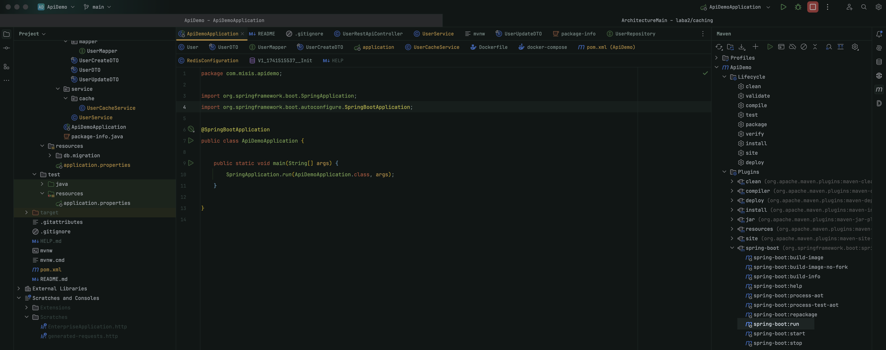
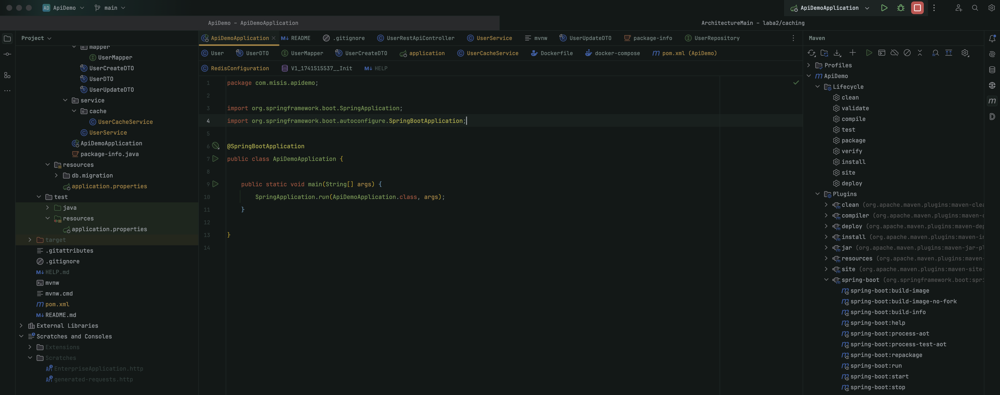

## **Описание проекта**

Этот проект представляет собой **REST API** для управления пользователями. 
Реализованы **CRUD операции** (создание, чтение, обновление, удаление).

---

## **Технологии**

| Технология      | Использование |
|----------------|--------------|
| **Spring Boot** | Разработка REST API |
| **Spring Data JPA** | Работа с БД |
| **PostgreSQL** | Хранение данных |
| **Flyway** | Миграции БД |
| **MapStruct** | Маппинг Entity ↔ DTO |
| **Spring Validation** | Валидация входных данных |
| **OpenAPI (Swagger UI)** | Документирование API |

---

## **Запуск через Docker Compose**

**Шаги:**

1. **Склонируйте репозиторий**
   ```bash
   git clone https://gitflic.ru/project/constromanov/arhitekturirovanie-lr.git
   cd arhitekturirovanie-lr
   ```

2. **Запустите контейнеры**
   ```bash
   cd dockercompose
   docker-compose up -d
   ```

3. **Запустите приложение**

Выполните `mvn spring-boot:run` через Intellij:



Или нажмите на кнопку запуска приложения:



**После запуска API доступно по:** `http://localhost:8080`  
**Swagger UI:** `http://localhost:8080/swagger-ui.html`  
**Документация OpenAPI:** `http://localhost:8080/api-docs`  

---

## **Структура проекта**

```
📂 src/main/java/com/misis/apidemo
 ├── 📂 controller       # Контроллеры (REST API)
 │   ├── UserRestApiController.java
 │
 ├── 📂 db              # Работа с БД
 │   ├── User.java
 │   ├── UserRepository.java
 │
 ├── 📂 dto             # Data Transfer Objects (DTO)
 │   ├── UserCreateDTO.java
 │   ├── UserDTO.java
 │   ├── UserUpdateDTO.java
 │   ├── 📂 mapper       # MapStruct маппинг
 │       ├── UserMapper.java
 │
 ├── 📂 service         # Основная логика приложения
 │   ├── ApiDemoApplication.java
 │
 ├── package-info.java  # Информация о пакете
```

---
