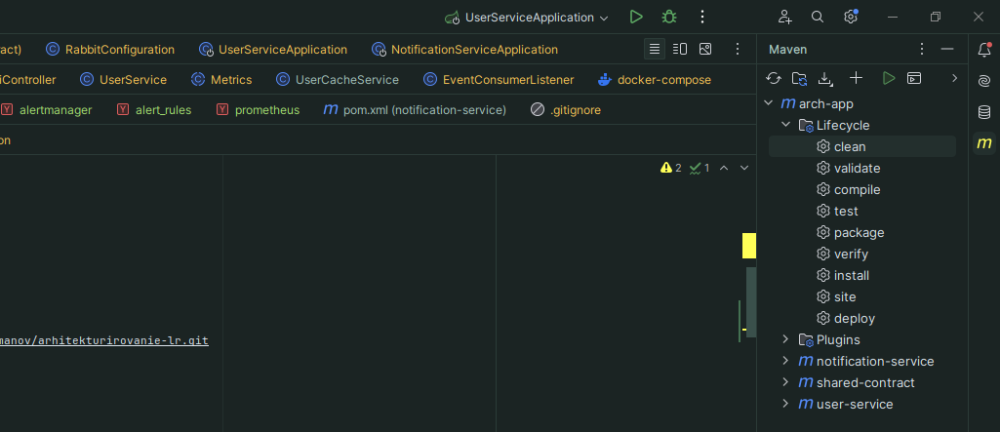

## **Описание проекта**

Этот проект представляет собой мульти-модульный монорепозиторий, в котором собраны сервисы, используемые в лабораторных работах.

Модуль `user-service` представляет собой **REST API** для управления пользователями. 
Реализованы **CRUD операции** (создание, чтение, обновление, удаление).

Модуль `notification-service` представляет собой сервис, управляющий нотификациями. 
В данный момент никак не связан с другими компонентами системы.

Модуль `shared-contracts` содержит в себе контракты, общие для компонентов системы.

---

## **Технологии**

| Технология      | Использование |
|----------------|--------------|
| **Spring Boot** | Разработка REST API |
| **Spring Data JPA** | Работа с БД |
| **PostgreSQL** | Хранение данных |
| **Flyway** | Миграции БД |
| **MapStruct** | Маппинг Entity ↔ DTO |
| **Spring Validation** | Валидация входных данных |
| **OpenAPI (Swagger UI)** | Документирование API |

---

## **Запуск через Docker Compose**

**Шаги:**

1. **Склонируйте репозиторий**
   ```bash
   git clone https://gitflic.ru/project/constromanov/arhitekturirovanie-lr.git
   cd arhitekturirovanie-lr
   ```

2. **Соберите исходники сервисов**
   ```bash
   mvn clean install
   ```
   
   Или используейте вкладку maven в IntellijIDEA (кнопки clean и install во вкладке arch-app):
   
   

3. **Соберите контейнеры сервисов**
   ```bash
   cd dockercompose
   docker-compose build
   ```

4. **Запустите контейнеры**
   ```bash
   cd dockercompose
   docker-compose up -d
   ```

**После запуска user-service API доступно по:** `http://localhost:8080`  
**Swagger UI:** `http://localhost:8080/swagger-ui.html`  
**Документация OpenAPI:** `http://localhost:8080/api-docs`  

**После внесения изменеий в код выполните команду `docker compose down` и повторите шаги 2-4**

---

## **Структура проекта**

```
📁 папка, в которой лежит проект
├── 📁 user-service/              # сервис для работы с пользователями
│   ├── 📁 src/main/java/com/misis/archapp/user/ # исходный код сервиса
│   ├── 📁 resources/             # ресурсы, конфиг. файлы
│   ├── Dockerfile
│   └── pom.xml                    # файл для менеджмента зависимостей сервиса
│
├── 📁 notification-service/       # сервис отправки уведомлений
│   ├── 📁 src/main/java/com/misis/archapp/notification/  # исходный код сервиса
│   ├── 📁 resources/              # ресурсы, конфиг. файлы
│   ├── Dockerfile
│   └── pom.xml                    # файл для менеджмента зависимостей сервиса
│
├── 📁 shared-contract/            # общие контракты (события, DTO)
│   ├── 📁 src/main/java/com/misis/archapp/contract/
│   ├── 📁 resources/
│   ├── pom.xml
│
└── pom.xml                        # родительский файл с зависимостями
```

### Структура модуля User Service

```
📁 user-service/src/main/java/com/misis/archapp/user
├── 📁 configuration
│   └── RedisConfiguration.java          # Конфигурация Redis-клиента
│
├── 📁 controller
│   └── UserRestApiController.java       # REST API для работы с пользователями
│
├── 📁 db
│   ├── User.java                        # JPA-сущность пользователя
│   └── UserRepository.java              # Репозиторий Spring Data JPA
│
├── 📁 dto
│   ├── UserCreateDTO.java               # DTO для создания пользователя
│   ├── UserUpdateDTO.java               # DTO для обновления пользователя
│   ├── UserDTO.java                     # DTO для возврата пользователю
│   └── 📁 mapper
│       └── UserMapper.java              # MapStruct-маппер User <-> DTO
│
├── 📁 service
│   ├── UserService.java                 # Бизнес-логика
│   ├── 📁 cache
│   │   └── UserCacheService.java        # Отдельный слой кэширования
│   └── package-info.java
│
├── UserServiceApplication.java          # Точка входа
├── 📁 resources
│   ├── application.properties           # Конфигурация приложения
│   └── 📁 db.migration                  # Flyway миграции
```

### Структура модуля Notification Service

```
📁 notification-service/src/main/java/com/misis/archapp/notification
├── 📁 service
│   ├── NotificationService.java            # Логика отправки уведомлений
│   └── package-info.java
└── NotificationServiceApplication.java     # Точка входа
```
---
